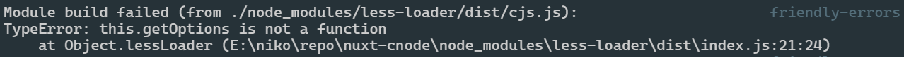

全局的样式文件可以通过`nuxt.config.js`的`css`选项指定

```javascript
export default {
  css: ['element-ui/lib/theme-chalk/index.css', '@/assets/styles/reset.less'],
}
```

如果要用到预处理器，不需要额外的配置，但是需要安装相关的依赖，这里以`less`为例：

```sh
npm install -D less less-loader@7.3.0
```

这里注意`less-loader`在安装的时候使用了指定版本号，这是因为`less-loader`8.0.0 版本开始会有兼容问题，报下面的错，而 8.0.0 的上一个版本就是 7.3.0



# 全局注入 less 变量

如果不全局注入，所有要用到 less 变量的页面都要手动`@import`一下，很麻烦，利用`build.styleResources`选项可以全局注入变量和 mixin。但是要注意，这里只应该注入变量和 mixin，其它的基础样式文件不应该在这里注入，而应该在`css`选项里注入。

**nuxt.config.js**

```diff
  export default {
    build: {
+     styleResources: {
+       // 这里不能使用路径别名，只能使用绝对或相对路径
+       less: './assets/styles/variables.less',
+     },
    },
  }
```

上面的方法在命令行提示一个警告：`Using styleResources without the @nuxtjs/style-resources is not suggested and can lead to severe performance issues. Please use https://github.com/nuxt-community/style-resources-module`

意思是，不通过`@nuxtjs/style-resources`模块使用 styleResources 会导致性能问题。所以重点来了，**上面的配置是不对的，改用下面的配置！！！**

```sh
npm install @nuxtjs/style-resources -D
```

**nuxt.config.js**

```diff
  export default {
    build: {
_     styleResources: {
_       // 这里不能使用路径别名，只能使用绝对或相对路径
_       less: './assets/styles/variables.less',
_     },
    },
+   buildModules: [
+     '@nuxtjs/style-resources',
+   ],
+   styleResources: {
+     less: ['./assets/styles/variables.less'],
+   },
  }
```
