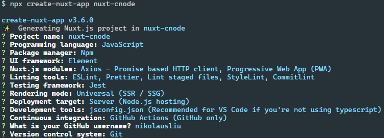

```sh
npx create-nuxt-app nuxt-cnode
```



github 新建 nuxt-cnode 仓库

```sh
cd nuxt-cnode
git add .
git commit -m "feta: 项目初始化"
git remote add origin git@github.com:nikolausliu/nuxt-cnode.git
git branch -M main
git push -u origin main
```

修改 host 和 port，**nuxt.config.js**

```diff
  export default {
+   server: {
+     host: '0.0.0.0',
+     port: 8000,
+   },
  }
```

新增 **.vscode** 文件夹，新增 **.vscode/extensions.json** 和 **.vscode/settings.json**
