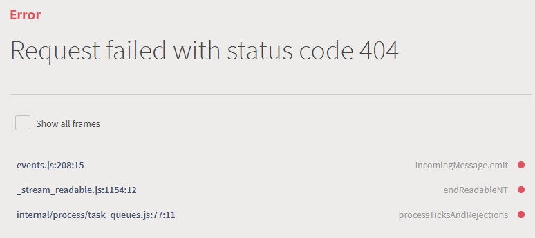
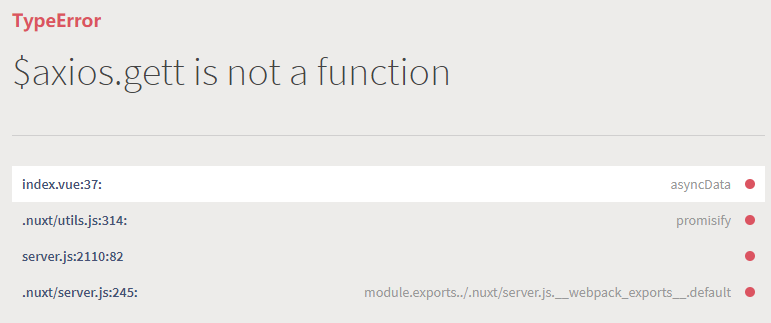
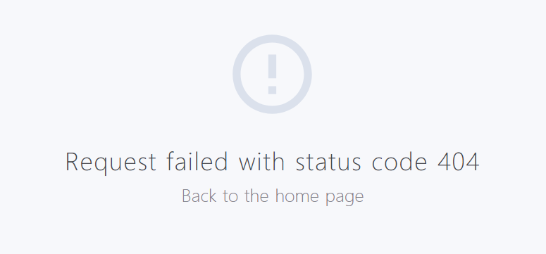
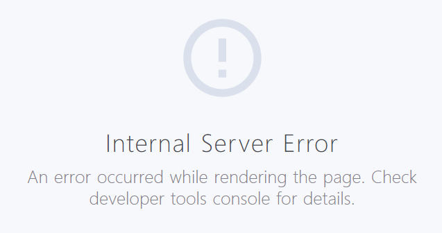

在 nuxt 中是如何捕获及处理错误的呢？从一个简单的例子看起：

**pages/index.vue**

```vue
<script>
export default {
  async asyncData({ $axios }) {
    const res = await $axios.get('https://cnodejs.org/api/v1/topics')
    console.log(res)
  },
}
</script>
```

上面的示例代码在`asyncData`中使用`@nuxtjs/axios`模块请求了一个接口，接口正常返回了数据并把数据渲染在了页面上。那如果在`asyncData`中发生了错误，页面还能正常渲染吗？

# 未捕获的错误

**pages/index.vue**

```diff
-   const res = await $axios.get('https://cnodejs.org/api/v1/topics')
+   const res = await $axios.get('https://cnodejs.org/api/v1/topics666')
```

上面的代码中，我在原来请求的 url 后追加了`666`，现在请求的就是一个不存在 url，服务的响应状态码会变成 404。此时访问页面会看到直接渲染了错误信息。



再看另一种情况：

```diff
-   const res = await $axios.get('https://cnodejs.org/api/v1/topics')
+   const res = await $axios.gett('https://cnodejs.org/api/v1/topics')
```

上面的代码中，我把`$axios.get`故意改成了`$axios.gett`，由于`$axios`上并不存在`gett`，所以会报错。此时页面同样把错误信息渲染了出来。



**在 asyncData 中，只要发生了错误，并且错误没有被捕获，就会像上面这样把错误信息直接渲染在页面上。**

# 捕获错误

那么，我们把错误捕获，页面是不是就不会直接渲染错误信息了呢？答案是肯定的。下面的代码使用`try...catch`块来捕获错误，页面又能正常渲染了。

**pages/index.vue**

```diff
  async asyncData({ $axios }) {
+   try {
      const res = await $axios.get('https://cnodejs.org/api/v1/topics666')
      console.log(res)
+   } catch (e) {
+     console.log(e)
+   }
  },
```

# 捕获错误后渲染 error 页面

一种常规的作法是，在`catch`块里使用`error`方法展示一个通用的 error 页面。

```diff
- async asyncData({ $axios }) {
+ async asyncData({ $axios, error }) {
    try {
      const res = await $axios.get('https://cnodejs.org/api/v1/topics666')
      console.log(res)
    } catch (e) {
      console.log(e)
+     error({
+       statusCode: e.response.status,
+       message: e.message,
+     })
    }
  },
```



# 更优雅的错误处理方式

无论发生了什么错误都展示一个 error 页面是一个很粗暴的作法，虽然官方推荐的是这种作法，但我们要学会变通。当我们在开发单页应用时，如果我们请求的某个 list 接口报错了，我们通常会展示一个空的列表，或者在列表的位置展示一个错误信息，而不影响页面的其它部分的展示。通过下面的方法，我们可以实现类似单页应用里的这种效果：

**pages/index.vue**

```vue
<template>
  <div class="container">
    <div v-if="!isError" class="list">
      <div v-for="item in list" :key="item.id" class="list-item">{{ item.title }}</div>
    </div>
    <p v-else class="error">An error occurred :(</p>
  </div>
</template>

<script>
export default {
  async asyncData({ $axios, error }) {
    try {
      const res = await $axios.get('https://cnodejs.org/api/v1/topics666')
      return {
        list: res.data.data,
        isError: false,
      }
    } catch (e) {
      return {
        list: [],
        isError: true,
      }
    }
  },
  data() {
    return {
      list: [],
      isError: false,
    }
  },
}
</script>
```

# 使用 fetch hook

上面是`asyncData`展示错误信息的方法，如果使用`fetch`hook 会更简单，可以用`$fetchState.pending`来渲染加载中状态，用`$fetchState.error`来渲染错误状态，调用`$fetch()`方法重新调用一遍`fetch()`来重新请求接口。

**pages/index.vue**

```vue
<template>
  <div class="container">
    <p v-if="$fetchState.pending">Fetching...</p>
    <p v-else-if="$fetchState.error">An error occurred :(</p>
    <div v-else>
      <div v-if="!isError" class="list">
        <div v-for="item in list" :key="item.id" class="list-item">{{ item.title }}</div>
      </div>
      <button @click="$fetch">Refresh</button>
    </div>
  </div>
</template>

<script>
export default {
  data() {
    return {
      list: [],
      isError: false,
    }
  },
  async fetch() {
    const res = await this.$axios.get('https://cnodejs.org/api/v1/topics666')
    this.list = res.data.data
    console.log(res)
  },
}
</script>
```

`fetch`内不加`try...catch`块捕获错误，也是不会导致页面渲染错误信息的，但是会在控制台报错，所以为了避免控制台报错，最好还是加上错误捕获代码。

# axios 错误拦截器

使用`@nuxtjs/axios`模块，我们通常会使用到拦截器。

**nuxt.config.js**

```diff
  export default {
-   plugins: ['@/plugins/element-ui'],
+   plugins: ['@/plugins/element-ui', '@/plugins/axios'],
  }
```

**plugins/axios.js**

```javascript
export default function ({ $axios }) {
  $axios.onRequest((config) => {
    console.log('Making request to ' + config.url)
  })

  $axios.onError((error) => {
    console.log(error)
  })
}
```

如果我们在错误拦截器`onError`中不返回任何值，当请求发生错误时，错误会向上冒泡到页面。什么意思呢？看下面的代码：

**plugins/axios.js**

```diff
- export default function ({ $axios }) {
+ export default function ({ $axios, error: nuxtError }) {
    $axios.onRequest((config) => {
      console.log('Making request to ' + config.url)
    })

    $axios.onError((error) => {
      console.log('error', error)
+     nuxtError({
+       statusCode: error.response.status,
+       message: error.message,
+     })
    })
  }
```

**pages/index.vue**

```vue
<script>
export default {
  async asyncData({ $axios, error }) {
    try {
      const res = await $axios.get('https://cnodejs.org/api/v1/topics666')
      console.log(res)
      return {
        list: res.data.data,
        isError: false,
      }
    } catch (e) {
      console.log(e)
    }
  },
}
</script>
```

上面的代码在错误拦截器`onError中`使用`error()`方法渲染了 error 页面，由于这里请求了错误的 url，所以 error 页面渲染的是 404 之类的文字。

由于在`onError`中的错误会向上冒泡到页面，所以会被`asyncData`的`catch`块捕获，那如果我在`catch`块里再调一次`error`传入其它的参数，error 页面是不是会渲染这里传入的参数呢？

```diff
<script>
export default {
  async asyncData({ $axios, error }) {
    try {
      const res = await $axios.get('https://cnodejs.org/api/v1/topics666')
      console.log(res)
      return {
        list: res.data.data,
        isError: false,
      }
    } catch (e) {
      console.log(e)
+     error({
+       statusCode: 500,
+       message: 'Internal Server Error',
+     })
    }
  },
}
</script>
```



可以看到，确实渲染了`catch`块里的`error()`，说明错误冒泡到了页面。

那么`onError`中如何阻止错误向上冒泡呢？官网说的是：

> When intercepting an error, you can return a resolved promise to prevent the error from propagating.

意思是，返回一个`resolved`的 promise 对象即可，经过测试，我发现直接返回 error 对象也是 ok 的。

```diff
  export default function ({ $axios, error: nuxtError }) {
    $axios.onRequest((config) => {
      console.log('Making request to ' + config.url)
    })

    $axios.onError((error) => {
      console.log('error', error)
      nuxtError({
        statusCode: error.response.status,
        message: error.message,
      })
+     // return error
+     return Promsie.resolve(false)
    })
  }
```

# 总结

- `asyncData`中未捕获的错误会导致渲染错误信息，常见方案是捕获错误并渲染 error 页面，还可以通过额外的处理在局部显示错误信息。
- `fetch`内未捕获的错误不会导致渲染错误信息但会报错，所以还是应该捕获错误。
- `onError`拦截器中的错误默认会向上冒泡到页面，返回一个`resolved promise`对象或者直接返回错误对象可以阻止错误向上冒泡。
- 如果你打算在`onError`中直接使用`error()`渲染 error 页面，那么最好阻止错误冒泡。或者你可以在`onError`里不渲染 error 页面并且不阻止错误冒泡，在页面内做更细粒度的错误处理。
